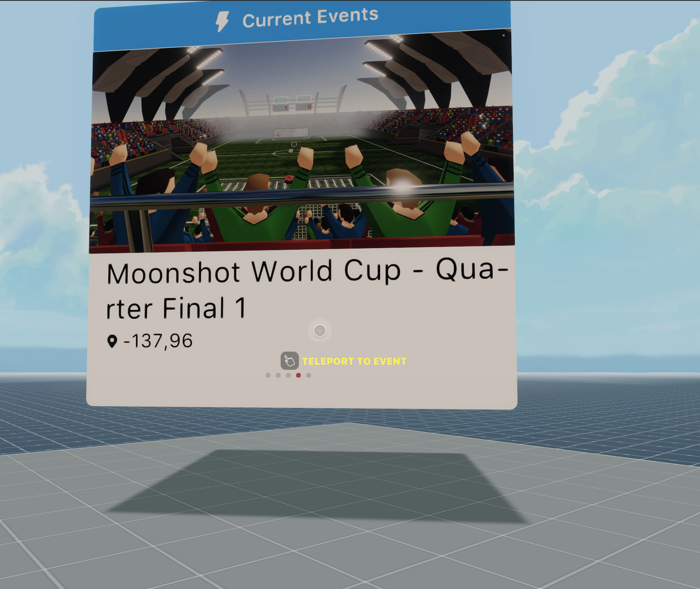

# D.Buzz Decentraland Feed 

Call the D.Buzz API to display post.


 

This scene shows you:
- How to call the D.Buzz API
- How to handle async functions that require waiting for a response
- How to parse a JSON response from an API
- How to parse incoming text fields so that they adjust to line width and a maximum length
- How to use a system to shuffle through different in-world UI screens 

The board displays the Latest post from D.Buzz

## About the Hive API:

Root URL: https://api.hive.blog/

{"id":3,"jsonrpc":"2.0","method":"bridge.get_ranked_posts","params":{"tag":"hive-193084","limit":50,"sort":"created","start_permlink":"","start_author":""}}

optional params:

- tag: hive-193084
- limit: 50
- sort: created
- start_permlink: 
- start_author: 

## Try it out

**Install the CLI**

Download and install the Decentraland CLI by running the following command:

```bash
npm i -g decentraland
```

**Previewing the scene**

Download this example and navigate to its directory, then run:

```
$:  dcl start
```

Any dependencies are installed and then the CLI opens the scene in a new browser tab.

**Scene Usage**

If there are no live events right now, you won't see the board when running the preview. If there are several live events, they will be shuffled through every few seconds, or you can also click on the dots on the bottom of the board to switch through them manually.


Learn more about how to build your own scenes in our [documentation](https://docs.decentraland.org/) site.

If something doesn’t work, please [file an issue](https://github.com/decentraland-scenes/Awesome-Repository/issues/new).

## Copyright info

This scene is protected with a standard Apache 2 licence. See the terms and conditions in the [LICENSE](/LICENSE) file.
